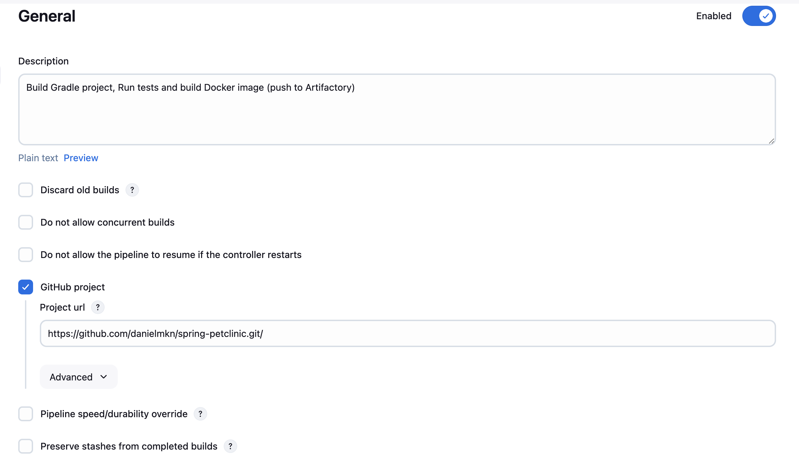
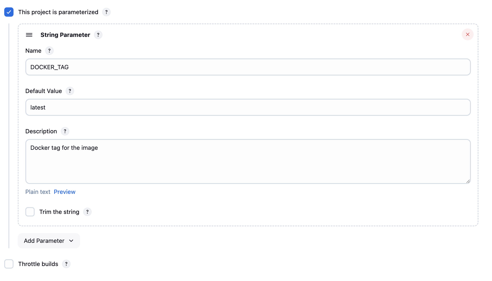
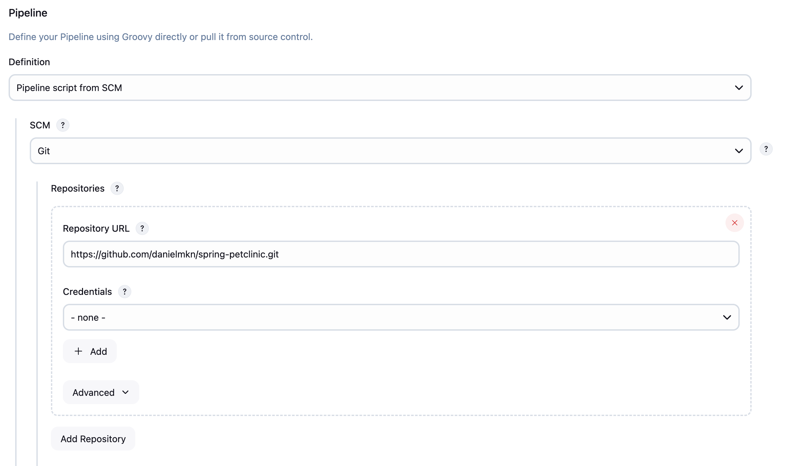
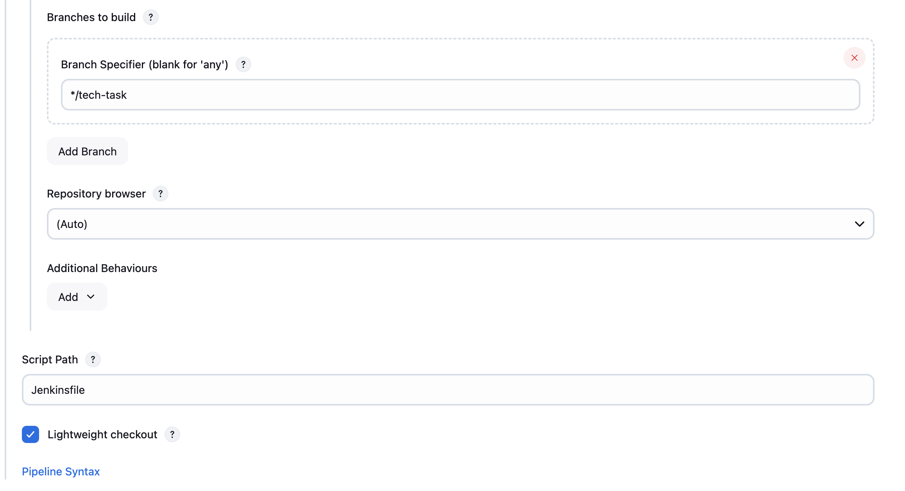

## Petclinic assignment
### Assignment description

Spring Petclinic is a [Spring Boot](https://spring.io/guides/gs/spring-boot) application built using [Maven](https://spring.io/guides/gs/maven/) or [Gradle](https://spring.io/guides/gs/gradle/).
We use Maven for building, because of JCenter dependency resolution requirement (JCenter support is deprecated in Gradle).

Steps in the assignment: 

1. Build the Petclinic application. 
2. Run tests. 
3. Package the project as a Docker image. 
4. Push Docker image to Docker repository. 

### Jenkins

To execute the steps described above, we use Jenkins installed on Mac with Homebrew. Check the [installation instruction](https://www.jenkins.io/download/lts/macos/) for detailed installation steps. 
Docker is not working out of the box with local Jenkins installation on Mac, please follow the instruction [here](https://stackoverflow.com/questions/40043004/docker-command-not-found-mac-mini-only-happens-in-jenkins-shell-step-but-wo/58688536#58688536) to fix that. 

### Dockerfile

We use multi-stage Docker build for the project to reduce the image size.

### Artifactory

To publish the image we use Artifactory local Docker repository. This repository is scanned for vulnerabilities by JFrog Xray. 
Potentially, we can block the deployment based on the Xray policies, but this is out of scope of current assignment.

### End-To-End test

To run e2e flow please follow the steps:

1. Install Jenkins locally, using the instruction above. It will run on `loalhost:8080`.
2. Modify Jenkins `plist` file to make Docker work. Restart Jenkins. 
3. Create local Docker repository in your Artifactory instance. Generate token by using `Set me up` function. 
4. Add new `Text secret` with your Artifactory token to [Jenkins credentials manager](https://www.jenkins.io/doc/book/using/using-credentials/).
5. Create new pipeline with the following parameters: 






5. Run jenkins job with a version parameter. The pipeline will buld and test the application, then create Docker image and push it to the Docker repository. 

As a result of teh pipeline execution, image will be pushed to the repository in Partnership Artifactory instance: `partnership-petclinic.jfrog.io/petclinic:<TAG>` 

# Run application in Docker container

To run the application locally, execute the following command: 
```
docker run -p 8080:8080 partnership-petclinic.jfrog.io/petclinic:<TAG>
```
Application will be running on `localhost:8080`. 
